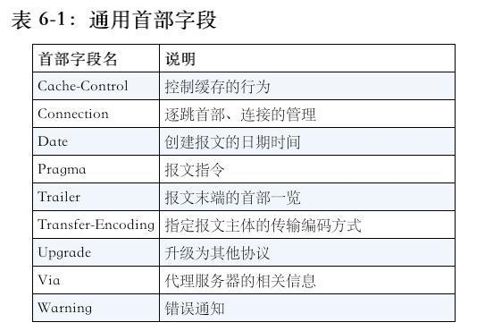
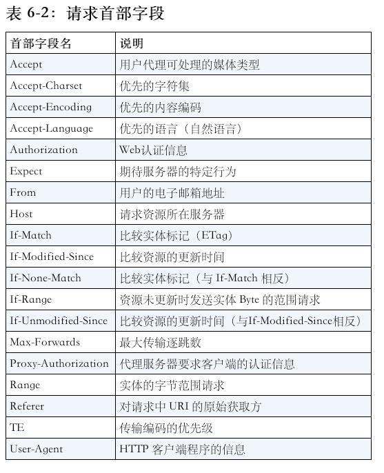
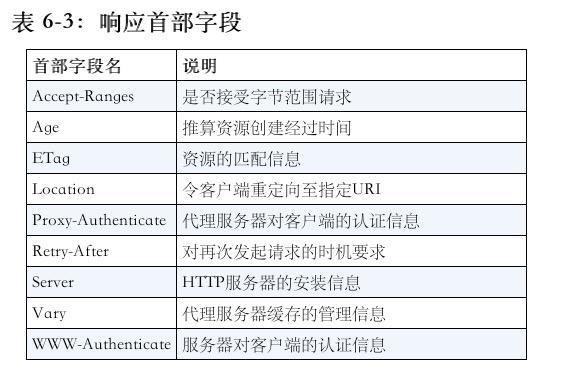
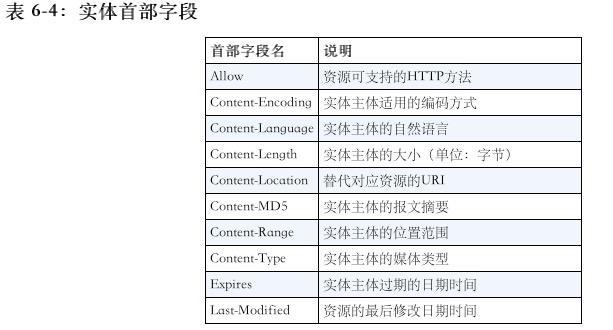

# HTTP首部

HTTP协议的请求和响应报文中必定包含HTTP首部。首部内容为客户端和服务器分别处理请求和响应提供所需要的信息。

HTTP首部字段是由首部字段名和字段值构成的，中间用冒号“:”分割。

例如：
```
Content-type: text/html
```
另外字段值对应单个HTTP首部可以有多个值，如下
```
Keep-Alive: timeout=15, max=10
```

> 若HTTP首部字段重复了会如何？
<br/>
<br/>
> 规范内尚未明确，不同浏览器的处理逻辑不通。有的处理第一次出现的，有的处理最后一次出现的。

## 4种HTTP首部字段类型（按实际用途分）
- 通用首部字段

请求报文和响应报文都会使用的首部

- 请求首部字段

从客户端向服务器端发送请求报文时使用的首部。补充了请求的附加内容、客户端信息、响应内容相关优先级等信息。

- 响应首部字段

从服务端向客户器端返回响应报文时使用的首部。补充了响应的附加内容，也会要求客户端附加额外的内容信息。

- 实体首部字段

针对请求报文和响应报文的实体部分使用的首部。补充了资源内容更新时间等与实体有关的信息。

## HTTP/1.1 首部字段一览
HTTP/1.1 规范定义了如下47种首部字段

- 通用首部字段



- 请求首部字段



- 响应首部字段



- 实体首部字段



## 非HTTP/1.1 首部字段

Cookie，Set-Cookie，Content-Disposition等在其他RFC中定义的首部字段，它们的使用频率也很高。

## End-to-end 首部和 Hop-by-hop 首部（按缓存代理和非缓存代理分）

- 端到端首部（End-to-end Header）

分在此类别中的首部会转发给请求/响应对应的最终接收目标，且必须保存在由缓存生成的响应中，另外规定它必须被转发。

- 逐跳首部（Hop-by-hop Header）

分在此类别中的首部只对单次转发有效，会因通过缓存或代理而不再转发。HTTP/1.1和之后版本中，如果要使用 hop-by-hop 首部，需提供Connection首部字段。

下面8个首部字段为逐跳首部字段

- Connection
- Keep-Alive
- Proxy-Authenticate
- Proxy-Authorization
- Trailer
- TE
- Transfer-Encoding
- Upgrade

除此之外，其他所有字段都属于端到端首部
